# Data Science & The Supreme Court

## Using Oral Arguments to Predict Supreme Court Case Outcomes

xxx

*by JDyBuncio*
*6/8/2020*

## Accessibility to the Code
To gain access to the cleaned dataframe and the helper functions I created to evaluate my models, one can clone this repository and run the following:

```
git clone https://github.com/jdybuncio/data-science-and-the-supreme-court.git
cd data-science-and-the-supreme-court
```

data-science-and-the-supreme-court/data/cases

https://github.com/walkerdb/supreme_court_transcripts.git
oyez/cases


```
python create_df_and_fit_models_script.py
```


This will create the dataframe I used and can be accessed in:  ```data/dataset_for_modeling_day_zero.csv``` 
Helper functions can be imported from: ```src/modeling_script.py```
The master branch also has a modeling_notebook repository which contains a python notebook which uses the cleaned dataframe to create the prediction models I evaluate.


## Other

<p align="center">
  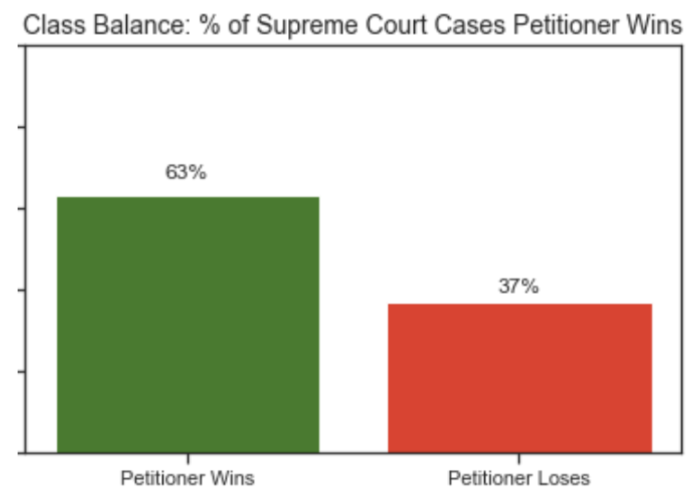
</p>

<p align="center">
  
</p>

<p align="center">
  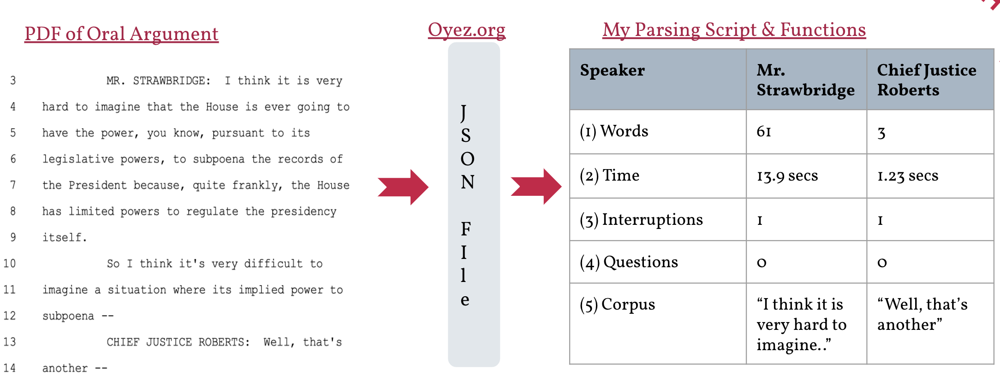
</p>

<p align="center">
  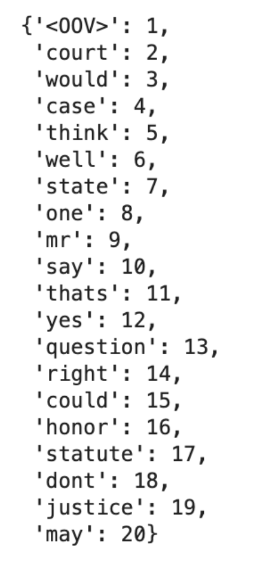
</p>

<p align="center">
  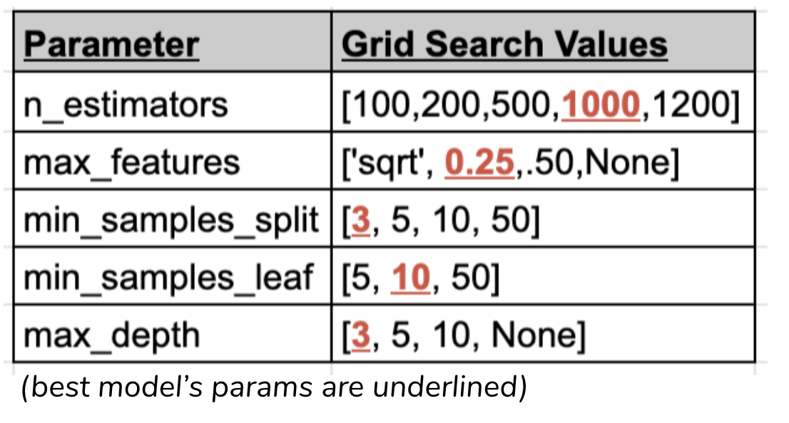
</p>

<p align="center">
  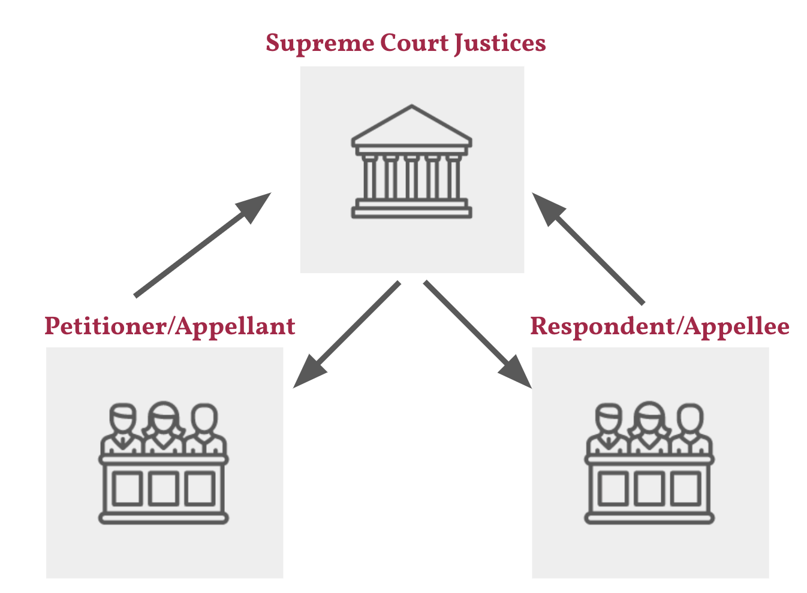
</p>

<p align="center">
  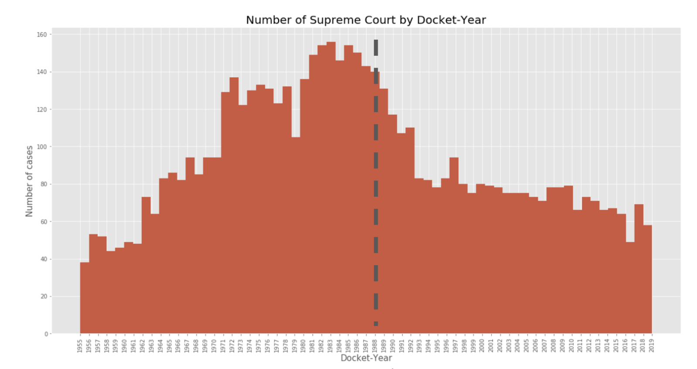
</p>

<p align="center">
  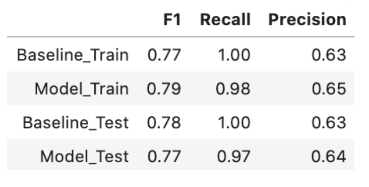
</p>

<p align="center">
  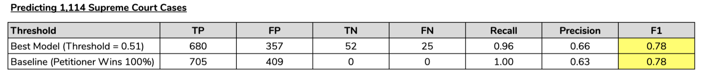
</p>

<p align="center">
  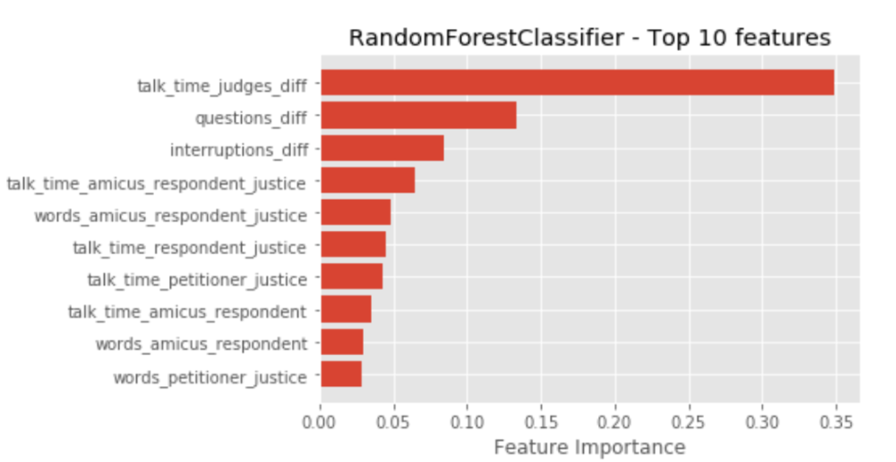
</p>


<p align="center">
  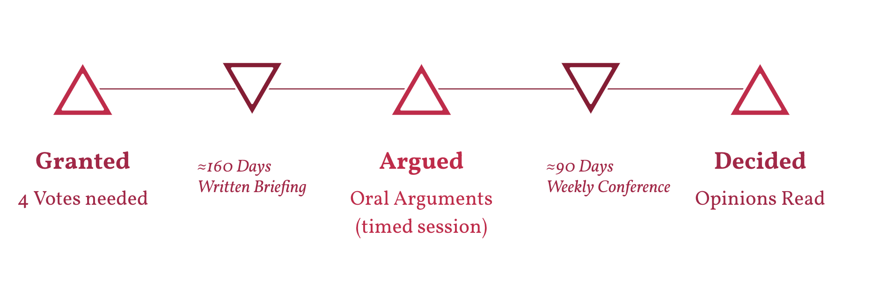
</p>

<p align="center">
  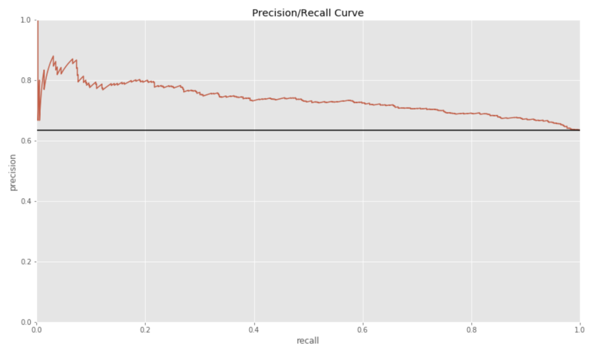
</p>

<p align="center">
  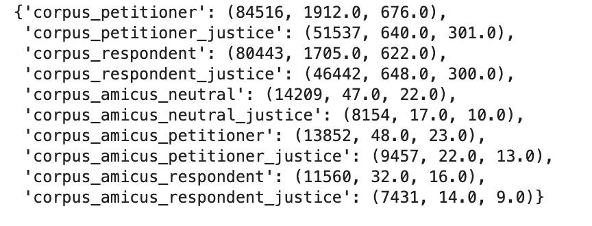
</p>


