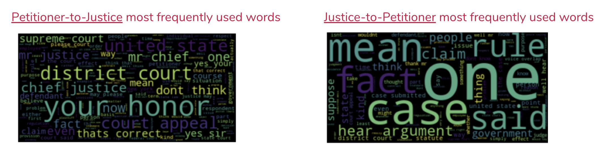
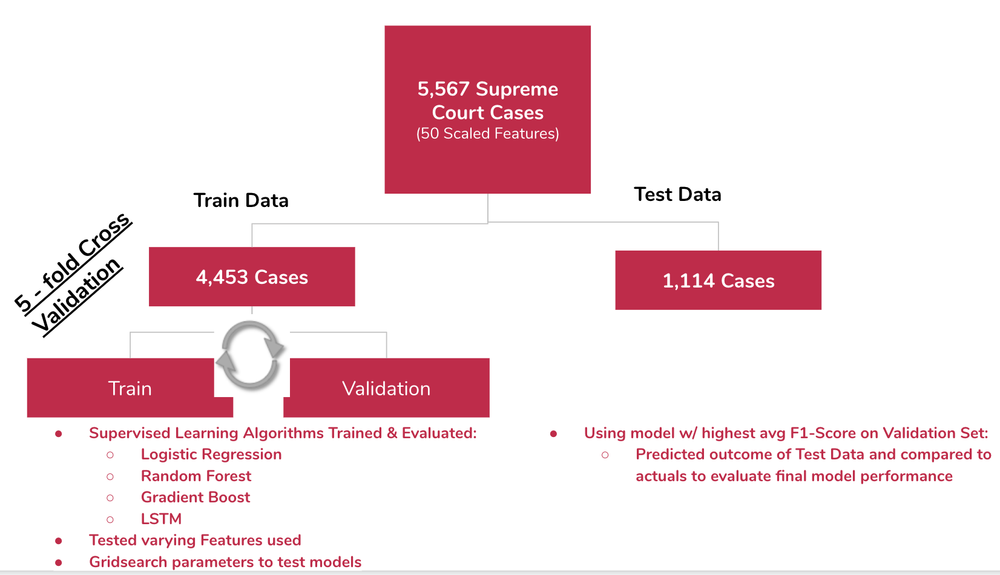
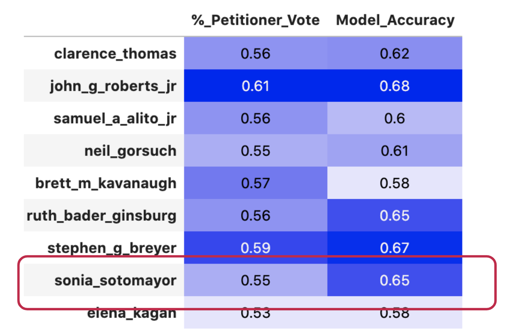
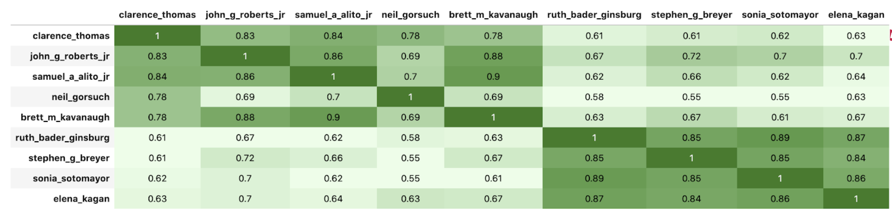

## Using Oral Arguments to Predict Supreme Court Case Outcomes

The United States Supreme Court has also had to adjust due to the global pandemic caused by COVID-19. While the court is still in session, oral arguments are being covered live for the first time and are taking place virtually via teleconference [source](https://www.nytimes.com/2020/05/03/us/politics/supreme-court-coronavirus.html). And while past sessions weren't covered live, it turns out that all oral arguments dating back to the 1950's have been transcribed and made publicly available via pdf format. 

This project processes the transcribed data from oral arguments in various ways, including using NLP, to create features to be used in models which can predict whether the Petitioner will win a given Supreme Court Case or not. I find that no model relying on just data from oral arguments can beat a strategy of predicting the Petitioner wins everytime as measured by F1-Scores from predictions made on a test set consisting of over 1,000 Supreme Court cases. Existing research in the field boasts about obtaining prediction models up to 70% accuracy using data only from oral arguments [source](https://fivethirtyeight.com/features/how-to-read-the-mind-of-a-supreme-court-justice/). I disagree with using Accuracy as a proper measure and find that the outcome of such a model is less helpful than that obtained via a Petitioner always wins approach.

*by JDyBuncio*
*6/8/2020*


## Table of Contents
- [Introduction](#introduction)
  - [Directory Structure and Replication](#directory-structure-and-replication)
  - [Supreme Court Intro](#supreme-court-intro)
  - [The Data](#the-data)
  - [Hypothesis](#hypothesis)
- [Exploratory Data Analysis](#exploratory-data-analysis-highlights)
- [Model Selection](#model-selection)
  - [Test Metric](#test-metric)
  - [Model Evaluation](#model-evaluation)
  - [Hyperparameter Tuning](#feature-importance)
  - [Results and Interpretation](#results-and-interpretation)
- [Conclusion](#conclusion)
- [Current Justice Specific Findings](#current-court)
- [Sources](#sources)

# Introduction

What the Supreme Court decides is binding law for all the courts in the United States. They represent the highest rung of the Judicial Branch and scholars dedicate themselves to predicting how the court and its 9 Justices will act. 

This project focuses on the most visible component we have as onlookers into the Supreme Court: Oral Arguments. The contents of this repository process the transcriptions of oral arguments into numerical features to see if they add to one's ability to predict the winning side of a Supreme Court case.


## Directory Structure and Replication

The Supreme Court data I used is stored as two types of JSON files: one containing the transcript from oral arguments and the other containing details of the case, such as its outcome and which side the speaker's in the case represent. 10 examples of each of these types of JSON files are contained in this repository's ```./data/cases``` directory. The file name structure has the structure: ```{year}.{docket #}.json``` and oral argument transcripts append ```t01, t02, t03, and t04``` depending on the number of oral arguments tied to a case.

The entire library of oral arguments I used can be obtained from the following [repository](https://github.com/walkerdb/supreme_court_transcripts.git) in its ```./oyez/cases``` directory. 

The functions I used to parse, combine, and model this data are contained in this repository's ```src``` directory.

To replicate the parsing, dataframe creation, and model tuning that this repository covers, one can run the following:

```
#Clone this repository
git clone https://github.com/jdybuncio/data-science-and-the-supreme-court.git
cd data-science-and-the-supreme-court

#Run Script to create dataframe and to perform model tuning 
python create_df_and_fit_models_script.py
```

This will create the dataframe I used for modeling and identify the best prediction model given the data provided. An example of what the modeling dataframe looks like is in the data directory.

System Requirements: Python 3.7.3

Required Libraries: Pandas, numpy, json, os, sklearn, collections, seaborn, matplotlib, and tensorflow

[Back to Top](#Table-of-Contents)

## Supreme Court Intro

Cases come to the Supreme Court in two ways: cases in which the court has Original Jurisdiction, which are those involving  U.S. Ambassadors, Public Ministers, and States, and cases in which the court has ultimate Appellate Jurisdiction, which are those stemming from appeals to decisions made by the lower courts. The Court discusses cases during their weekly conferences and take on cases when 4 out of the 9 judges agree to hear it. 

* **Parties involved in a Supreme Court Case**
<p align="center">
  
</p>

Supreme Court cases consist of three central parties:
* A Petitioner - the side which brings the case to the court, and in most events, is the party which is appealing a decision made by a lower court 
* A Respondent - the side responding to the Petitioner
* The Justices - the 9 Supreme Court Justices who make up the Court

* **Timeline of a Supreme Court Case**
<p align="center">
  
</p>

Once a case is **Granted**, there is, on average, 160 days before it is argued in front of the Supreme Court. In this in-between time period, both sides of the case submit written briefings which are constrained by set page limits. **Oral Arguments** are then heard in front of the court. These are timed sessions which usually last for 1 hour. The most common structure is for the Petitioner to address the Justices and answer questions. The Respondent is then given an opportunity to do the same. And then the Petitioner usually is given a chance to rebuttal directly to the Justices. The Petitioner and Respondent do not address one another. After oral arguments, the case is discussed during the Court's weekly conferences and, though it varies, **Decisions** are given, on average, 90 days after a case is argued.

[Back to Top](#Table-of-Contents)

## The Data

The dataset I use consists of over 6,000 Supreme Court cases with transcribed oral arguments dating back to 1955. After removing cases which have missing data, such as an empty transcript file, and only looking at cases which have one oral argument, I am left with a sample of 5,567 Supreme Court cases. The distirbutuon of cases by Docket Year is shown in the following histogram. The decrease in cases per Year which starts in 1988 (highlighted by the brown dashed line) is due to the passing of the Supreme Court Case Selections Act in 1988 which gave the court additional discretion over the cases they can choose to take/pass.

<p align="center">
  
</p>

The following depicts the structure in how I parse the transcripts of oral arguments into numerical data, such as the number of words, questions, interruptions, and total talk time each party has. I added to what is shown by using case level data to find labels for which side wins the case and to identify when the Petitioner, Respondent, or Justice is speaking, and who they are speaking to.

<p align="center">
  
</p>


[Back to Top](#Table-of-Contents)

## Hypothesis

I hypothesize that, using data just from oral arguments, I will be able to create a prediction model for if the Petitioner Wins a case which can beat a Petitioner always wins strategy. There have been some studies, based on smaller datasets, which show that the side which receives more questions tends to lose more which makes me hopeful I can find some signal in my dataset [source](https://papers.ssrn.com/sol3/papers.cfm?abstract_id=1373965).

An ability to predict the outcome of a Supreme Court Case is helpful from two vantage points:
1) If I can interpolate inference, the findings could influence a Petitioner's Strategy during oral arguments
2) Since there are usually 3 months between an Oral Argument and a Decision, a prediction as to one's probability of winning can influence their strategy during this waiting period. For example, if one side know that they are predicted to lose, they could invest more in puting materials out there, such as Op-Eds, to try to influence the narrative and turn the opinion towards their direction.

[Back to Top](#Table-of-Contents)

# Exploratory Data Analysis Highlights

* **Class Balance**

<p align="center">
  
</p>

The Petitioner wins in 63% of the Cases I have in my sample, and the Respondent wins in 37% of cases. This follows in-line with what is known. This is logical given that any given Supreme Court case requires 4 votes by the Justices to be Granted and then only 5 votes to have the majority and win the case - though a lot can happen from the time a case is Granted, Argued, and Decided and there are several examples of a Petitioner getting no votes when a Decision ultimately comes. 

Due to this imbalance, I make sure to stratify my data when I apply a Train-Test split to maintain this same class balance in my Train and Test sets.

* **Relationships to Petitioner Winning Rates across some demographic variables**

<p align="center">
  
</p>


The following graph takes the difference in the amount Questions by the Justices to the Petitioner and to the Respondent and assigns each case to one of five buckets. The graph shows the Petitioner Win Rate % in each of these buckets. For example, Petitioners who received between 14 and 127 more questions than the Respondent won 51% of those cases, which is relative to a win rate of 73% for Petitioners who received 13 or less questions that the Respondent.

* **100 most frequent words ued by Petitioners to Justices and Justices to Petitioners**

<p align="center">
  
</p>

While I convert the transcripts of oral arguments to numerical data, I also conserved the transcriptions to be able to create NLP featues. The above shows the 100 most frequent used words using size to put their use relative to one another. I excluded stop words (exs: "a", "but", "how", etc.) and also performed lemmatization which combines words which are the same aside from a different inflectional ending. As the two world clouds show above, the most frequent used words don't seem to have a lot of meaning I can use to predict the outcome of a case. There are a lot of generic terms such as, "court", "honor", and "case." This informs my use of creating tf-idf features to try to find if certain words are important in a given oral argument with respect to all of them.

[Back to Top](#Table-of-Contents)

# Model Selection

## Test Metric

The metric I chose to evaluate my models was to optimize the **F1-Score** since I care more about the positive class and want to:
* Maximize Recall: Predict maximum % of Cases where the Petitioner Wins
* Maxmize Precision: Maximize the % of Predicted Petitioner Wins which are actually cases in which the Petitioner Wins

I believe this is a better strategy than optimizing for Accuracy, especially given my focus on being able to predict if the Petitioner wins a case or not.

[Back to Top](#Table-of-Contents)

## Model Evaluation

<p align="center">
  
</p>

The above shows the Modeling Workflow I applied. I used Cross Validation to evaluate the F1 Score of each of my models in order to direct my hyperparameter tuning and feature selection. I fit 3 main type of feature sets across the different models I tuned:
* Numerical Features: Talk Time, Words, Interruptions, and Questions for each speaking direction (ex: Petitioner to Justice, Justice to Petitioner). I also supplemented this with the difference in the number of questions, interruptions, and talk-time the Petitioner received relative to the Respondent.
* Numerical Features with added Tf-idf Features from NLP extraction excluding stop words, punctuation, and performing lemmatization.
* Entire Oral Argument Transcript: I fit an LSTM Model using the entire oral argument and case outcome label.

[Back to Top](#Table-of-Contents)

## Chosen Model
My Random Forest Model which included the Tf-idf features had the highest average F1-score of **0.79** from my cross validation (Recall = 0.98 Precision = 0.65). This barely outperformed a Baseline set by a Petitioner always wins strategy in any significant way and closely mimicked it by almost always predicting the Petitioner Wins.

Below is an example of the parameters I used via SKLearn's GridSearch to find the best values for the hyperparameters in my Random Forest model:

<p align="center">
  
</p>

## Feature Importance
Below shows the Top 10 Features measured using SKLearn's feature importance from my chosen Random Forest model. SKlean's feature importance is calculated by calculating the average decrease in impurity across trees in the forest, as a result of splits defined by a given feature. These features should not be interpreted too deeply aside from taking away that the difference in Petitioner and Respondent: Judge Talk Time, Questions, & Interruptions were the main drivers of informing my prediction model.

<p align="center">
  
</p>

## Results and Interpretation

* Precision-Recall Curve of Best Model at various Thresholds
<p align="center">
  
</p>

* Final Results broken down into its parts from final predictions (ex: Number of True Positives, True Negatives, False Positives, etc.)

<p align="center">
  
</p>

From my best Random Forest model, at a **threshold of 0.51**, I have:
* Recall - the percentage of Petitioner wins that I accurately predict, to be **0.96**. 
* Precision -  the percentage of Petitioner Win predictions are actually cases where they Win, to be **0.66**

My best model is not very different than a Petitioner always wins strategy and, in the end, my model's F1-Score was equal to that of a Petitioner always Wins strategy when used to predict the outcomes of my Test Data. In some respects this is not surprising given that cases span a wide array of issues and Petitioner's tend to represent various sides to a case. Their role is not specific to a specific stance consistently across cases. I also had a limited sample of 6,000 cases which is an explanation for why I did not find any signal in my LSTM models which were either stuck overfitting or could not fit at all. 


[Back to Top](#Table-of-Contents)

# Conclusion

> The secret to successful advocacy, is simply to get the court to ask your opponent more questions.” 
- Chief Justice Roberts [source](https://www.nytimes.com/2009/05/26/us/26bar.html?smid=nytcore-ios-share)

There is a belief, that was even echoed by the current Chief Justice, that the difference in questions one side receives relative to another is a predictor of a Supreme Court Case's outcome. I did find that this relationship was true when there was a large difference in questions the two sides received, and I also found this feature to be important in my best Random Forest Model. But, the work in this repository does not find that a model using this feature is any better than a Petitioner always wins strategy when trying to make predictions across all Supreme Court cases, even those wherein there is not large difference in questions received by either of the sides. 

I find that the best strategy to predict a Supreme Court Case's winner is to pick which side brings the case to the Court. This logically fits due to the nature that doing so requires 4 votes by the Justices to be Granted, and then only 5 votes to end up winning the Case. 

I did run some tests where, instead of optimizing for an F-1 Score, I optimized for Accuracy and I did find that I could create a model which has an Accuracy on the Test Set of 67% (F1-Score: 0.77, Recall: .87, Precision: .68). This is closer in line of what I see studies quoting, which is that they can predict the outcome of a case at around 65-70% accuracy [source](https://fivethirtyeight.com/features/how-to-read-the-mind-of-a-supreme-court-justice/). I find these studies to be misleading due to the fact that 63% of the time the Petitioner side wins and while one can get to a model which improves upon that accuracy, it is a question of if Accuracy is a good metric to optimize for.

For example: which model would one rather have:

**Petitioner Always Win's Strategy**
* Recall - the percentage of Petitioner wins that I accurately predicted: **100%**. 
* Precision -  the percentage of Petitioner Win predictions which are actually cases where they Win: **63%**

or

**Model @ 67% Accuracy**
* Recall - the percentage of Petitioner wins that I accurately predicted: **87%**. 
* Precision -  the percentage of Petitioner Win predictions which are actually cases where they Win: **68%**

The dataset I used only consists of Oral Arguments which is limiting given that they are usually 1 hour timed sessions, and a lot about a case is decided outside of the room during that time. It is appealing to try to leverage this data in some way given its publicly available nature of an otherwise, opaque process.  In terms of future work, I would like to supplement this datasource by adding features which come from the decisions made by the lower court's and also a classification as to the category the case fits into and which side the Petitioner is representing.

[Back to Top](#Table-of-Contents)

# Current Court

While the dataset I created has some drawbacks as previously mentioned, it also has other applications. Below are some highlights I was able to find on the 9 current Supreme Court Justices. The first graph shows the percent of time each justice votes for the Petitioner side in cases in which they vote, and next to it is the outcome of the best model I could come up when optimized for Accuracy to add to the existing literature and form out there. It is not the biggest surprise that I was best able to gain the most signal in predicting Sonia Sotomayor's vote since she tends to make the most interruptions across cases.

* **Parties involved in a Supreme Court Case**
<p align="center">
  
</p>

The second graph shows how often the Justices vote in lock step with another. This shows the clear split between the 5 Justices who were appointed by Republic Presidents and the 4 who were appointed by Democrat Presidents.

* **Parties involved in a Supreme Court Case**
<p align="center">
  
</p>


# Sources

* JSON files for Case Data and Oral Argument Transcriptions come from Oyez.org
* I retrieved these files using the following github repository: https://github.com/walkerdb/supreme_court_transcripts

[Back to Top](#Table-of-Contents)
