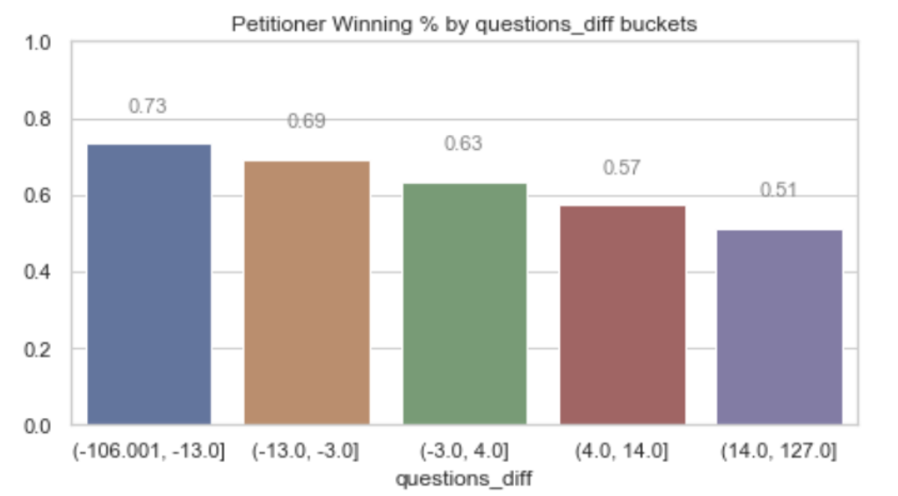

## Using Oral Arguments to Predict Supreme Court Case Outcomes

The United States Supreme Court has also had to adjust due to the global pandemic caused by COVID-19. While the court is still in session, oral arguments are being covered live for the first time and are taking place virtually via teleconference [source](https://www.nytimes.com/2020/05/03/us/politics/supreme-court-coronavirus.html). And while past sessions weren't covered live, it turns out that all oral arguments dating back to the 1950's have been transcribed and made publicly available via pdf format. 

This project processes transcribed data from oral arguments to create models which can predict whether the Petitioner will win a given Supreme Court Case or not. While the contents of this repository convert the oral arguments into various numerical features to test various models, I find that no model relying on just data from oral arguments can beat a strategy of predicting the Petitioner wins everytime. This goes against research done - albeit on smaller datasets -  which claim that the side which receives more questions tends to lose at a higher rate [source](https://www.nytimes.com/2009/05/26/us/26bar.html?smid=nytcore-ios-share).

*by JDyBuncio*
*6/8/2020*


## Table of Contents
- [Introduction](#introduction)
  - [Directory Structure and Replication](#directory-structure-and-replication)
  - [Supreme Court Intro](#supreme-court-intro)
  - [The Data](#the-data)
  - [Hypothesis](#hypothesis)
- [Exploratory Data Analysis](#exploratory-data-analysis-highlights)
- [Model Selection](#model-selection)
  - [Test Metric](#test-metric)
  - [Model Evaluation](#model-evaluation)
  - [Hyperparameter Tuning](#feature-importance)
  - [Results and Interpretation](#results-and-interpretation)
- [Conclusion](#conclusion)
- [Sources](#sources)

# Introduction

What the Supreme Court decides is binding law for all courts in the United States. They represent the highest rungs of the Judicial Branch and thus, scholars dedicate themselves to predicting how the court and its 9 Justices will react. Since a 1988 law which gave the Supreme Court added discretion over their caseload, the Supreme Courts hears arguments for 60-70 cases per year.

The contents of this repository process the transcriptions of oral arguments into numerical features to see if they add any signal to one's ability to predict the winning side of a Supreme Court case and test the hypothesis that the side which receives more questions is a predictor of which side will lose.


## Directory Structure and Replication

The Supreme Court data I used is stored as two types of JSON files: one containing the transcript from oral arguments and the other containing details of the case, such as its outcome. 10 examples of each of these types of JSON files are contained in this repository's ```./data/cases``` directory. The file name structure has the structure: ```{year}.{docket #}.json``` and oral argument transcripts append ```t01, t02, t03, and t04``` depending on the number of oral arguments tied to a case.

The entire library of oral arguments I used can be obtained from the following [repository](https://github.com/walkerdb/supreme_court_transcripts.git) in its ```./oyez/cases``` directory. 

The functions I used to parse, combine, and model this data are contained in this repository's ```src``` directory.

To replicate the parsing, dataframe creation, and model tuning that this repository covers, one can run the following:

```
#Clone this repository
git clone https://github.com/jdybuncio/data-science-and-the-supreme-court.git
cd data-science-and-the-supreme-court

#Run Script to create dataframe and to perform model tuning 
python create_df_and_fit_models_script.py
```

This will create the dataframe I used for modeling and identify the best prediction model given the data provided. An example of what the modeling dataframe looks like is in the data directory.

Required Packages: Python 3, pandas, numpy, json, os, sklearn, collections, seaborn, matplotlib, tensorflow

[Back to Top](#Table-of-Contents)

## Supreme Court Intro

Cases come to the Supreme Court in two ways: cases in which the court has Original Jurisdiction, which are those involving  Ambassadors, Public Ministers, and States, and cases in which the court has Ultimate Appellate Jurisdiction, which are those stemming from appeals to decisions made by the lower courts. The Court discusses cases during their weekly Conferences and take on cases when 4 out of the 9 judges agree to hear a case. 

* **Timeline of a Supreme Court Case**
<p align="center">
  
</p>

* **Parties involved in a Supreme Court Case**
<p align="center">
  
</p>

Supreme Court cases consist of:
* A Petitioner - the side which brings the case to the court
* A Respondent - the side responding to the Petitioner
* The Justices - the 9 Supreme Court Justices who make up the Court

Once a case is Granted, there is usually around 160 days before it is argued in front of the Supreme Court. In this in-between time period, both sides of the case submit written briefings which have page limits. Oral Arguments are then heard with each side given a chance to make their argument and answer questions from the Justices. These are timed sessions which usually last for 1 hour. The most common structure is for the Petitioner to address the Justices and answer questions. The Respondent is then given an opportunity to do the same. And then the Petitioner usually is given a chance to rebuttal directly to the Justices. The Petitioner and Respondent do not address one another. After oral arguments, the case is discussed during the Court's Weekly Conferences and, though it varies, Decisions are given around 90 days after a case is argued.


[Back to Top](#Table-of-Contents)

## The Data

The dataset I use consists of over 6,000 Supreme Court Cases with transcribed oral arguments dating back to 1955. After removing cases which have missing data, and only looking at Cases which have one oral argument, I am left with a sample of 5,567 Supreme Court Cases. The distirbutuon of cases by Year is shown in the following histogram. The decrease in Cases per Year which starts in 1988 (highlighted by the brown dashed line) is due to the passing of the Supreme Court Case Selections Act which gave the court additional discretion over the cases they can choose to take/pass.

<p align="center">
  
</p>

The following depicts the structure in how I parse the transcripts of oral arguments into numerical data, such as the number of words, questions, interruptions, and total talk time each party has. I added to what is shown by using the Case level data to find labels for both the speakering parties - i.e. so I can identify when the Petitioner, Respondent, or Justice is speaking, and who they are speaking to - and also for which side wins the case.

<p align="center">
  
</p>


[Back to Top](#Table-of-Contents)

## Hypothesis

I hypothesize that, using data just from oral arguments, I will be able to create a prediction model for if the Petitioner Wins a case which can beat a Petitioner always wins strategy. There have been some studies, based on smaller datasets, which show that the side which receives more questions tends to lose more which makes me hopeful I can find some signal [source](https://papers.ssrn.com/sol3/papers.cfm?abstract_id=1373965)

An ability to predict the outcome of a Supreme Court Case is helpful from two vantage points:
1) If I can interpolate inference, the findings could influence a Petitioner's Strategy during oral arguments
2) Since there are usually 3 months between an Oral Argument and a Decision, a prediction as to one's probability of winning can influence their strategy during this waiting period. For example, if one side find that they are predicted to lose, they could invest more in puting materials out there, such as Op-Eds, to try to influence the narrative.


[Back to Top](#Table-of-Contents)

# Exploratory Data Analysis Highlights

The Petitioner wins in 63% of the Cases I have in my sample, and the Respondent wins in 37% of cases. This follows in-line with what is known. This is logical given that a Case, which the Petitioner brings to the Court, requires 4 votes by the Justices to be Granted and then only 5 votes to have the majority and win the case - though a lot can happen from the time a case is Granted, Argued, and Decided and there are several examples of a Petitioner getting no votes when the Decision comes. 

Due to this imbalance, I make sure to stratify my data when I apply a Train-Test split to maintain this same class balance in my Train and Test sets.

* **Class Balance**

<p align="center">
  
</p>


The following graph takes the difference in Questions by the Justices to the Petitioner and to the Respondent and assigns each case to one of five buckets. The graphs show the Petitioner Win Rate % in each of these buckets. For example, Petitioners who received between 14 and 127 more questions than the Respondent won 51% of cases, which is relative to a win rate of 73% for Petitioners who received 13 or less questions that the Respondent.

* **Relationships to Petitioner Winning Rates across some demographic variables**

<p align="center">
  
</p>

While I convert transcripts to numerical data, I also conserved the transcriptions to be able to create NLP featues and also fit an LSTM model. The following shows the 20 most frequent words used in oral arguments after removing Stop Words. The <OOV> is a catch call for words outside of the 10,000 most-used ones.

* **20 most frequent words found**

<p align="center">
  
</p>

[Back to Top](#Table-of-Contents)

# Model Selection

## Test Metric

The metric I chose to evaluate my models was to optimize the **F1-Score** since I care more about the positive class and want to:
* Maximize Recall: Predict maximum % of Cases where the Petitioner Wins
* Maxmize Precision: Maximize the % of Predicted Petitioner Wins which are actually cases in which the Petitioner Wins

[Back to Top](#Table-of-Contents)

## Model Evaluation

<p align="center">
  
</p>

The above shows the Modeling Workflow I applied. I used Cross Validation to evaluate the F1 Score of each of my models in order to direct my hyperparameter tuning and feature selection. I fit 3 main type of feature sets across the different models I tuned:
* Numerical Features: Talk Time, Words, Interruptions, and Questions for each speaking direction (ex: Petitioner to Justice, Justice to Petitioner).
* Numerical Features with added Tf-idf Features from NLP extraction
* Entire Oral Argument Transcript: I fit an LSTM Model using the entire oral argument and Case outcome label.

[Back to Top](#Table-of-Contents)

## Chosen Model
My Random Forest Model which included the Tf-idf features had the highest average F1-score of **0.79** from my cross validation (Recall = 0.98 Precision = 0.65). This barely outperformed a Baseline set by a Petitioner always wins strategy in any significant way and closely mimicked it by almost always predicting the Petitioner Wins.

Below is an example of the parameters I used via SKLearn's GridSearch to find the best values for the hyperparameters in my Random Forest model:

<p align="center">
  
</p>


## Feature Importance
Below shows the Top 10 Features measured using SKLearn's feature importance from my chosen Random Forest model. I 

<p align="center">
  
</p>

## Results and Interpretation

* Model & Baseline Results against Test Set

<p align="center">
  
</p>

* Precision-Recall Curve of Best Model at various Thresholds
<p align="center">
  
</p>

* Final Results broken down into its parts

<p align="center">
  
</p>

From my best Random Forest model, at a **threshold of 0.51**, I have:
* Recall - the percentage of Petitioner wins  that I accurately predict, to be **0.96**. 
* Precision -  the percentage of Petitioner Win predictions are actually cases where they Win, to be **0.66**

My best model is not very different than a Petitioner always wins strategy and, in the end, my model's F1-Score was equal to that of a Petitioner always Wins strategy when used to predict the outcomes of my Test Data.

[Back to Top](#Table-of-Contents)

# Conclusion

> The secret to successful advocacy, is simply to get the court to ask your opponent more questions.” 
- Chief Justice Roberts [source](https://www.nytimes.com/2009/05/26/us/26bar.html?smid=nytcore-ios-share)

There is a belief, that was even echoed by the current Chief Justice, that the difference in questions one side receives relative to another is a predictor of a Supreme Court Case's outcome. I did find this feature to be one of my most prevalent in my best Random Forest Model, but the work in this repository does not find that a model using this feature is any better than a Petitioner always wins strategy. 

I find that the largest predictor of a Supreme Court Case's outcome is which side brings the case to the Court which logically fits due to the nature that doing so requires 4 votes by the Justices to be Granted, and then only 5 votes to end up winning the Case. 

I did run some tests where, instead of optimizing for an F-1 Score, I optimized for Accuracy and I did find that I could create a model which has an Accuracy on the Test Set of 67% (F1-Score: 0.77, Recall: .87, Precision: .68). This is closer in line of what I see studies quoting, which is that they can predict the outcome of a case at around 65-70% accuracy [source](https://fivethirtyeight.com/features/how-to-read-the-mind-of-a-supreme-court-justice/). I find these studies to be misleading due to the fact that 63% of the time the Petitioner side wins and while one can get to a model which improves upon that accuracy, it is a question of if Accuracy is a good metric to optimize for.

For example: which model would one rather have:

**Petitioner Always Win's Strategy**
* Recall - the percentage of Petitioner wins  that I accurately predict, to be **1,00**. 
* Precision -  the percentage of Petitioner Win predictions are actually cases where they Win, to be **0.63**

or

**Model @ 67% Accuracy**
* Recall - the percentage of Petitioner wins  that I accurately predict, to be **0.87**. 
* Precision -  the percentage of Petitioner Win predictions are actually cases where they Win, to be **0.68**


In terms of future work, the dataset I used only consists of Oral Arguments which is limiting given that they are usually 1 hour timed sessions, and a lot about a case is decided outside of the room during that time. Butm it is appealing to try to leverage this data in some way given its publicly available nature, of an otherwise, opaque process.  In future work, I would like to expand this to see if I could leverage oral arguments to predict a certain Justice's vote and I would also look to supplement this datasource by adding a category which I could tie to each case. 

[Back to Top](#Table-of-Contents)


# Sources

* JSON files for Case Data and Oral Argument Transcriptions come from Oyez.org
* I retrieved these files using the following github repository: https://github.com/walkerdb/supreme_court_transcripts

[Back to Top](#Table-of-Contents)
